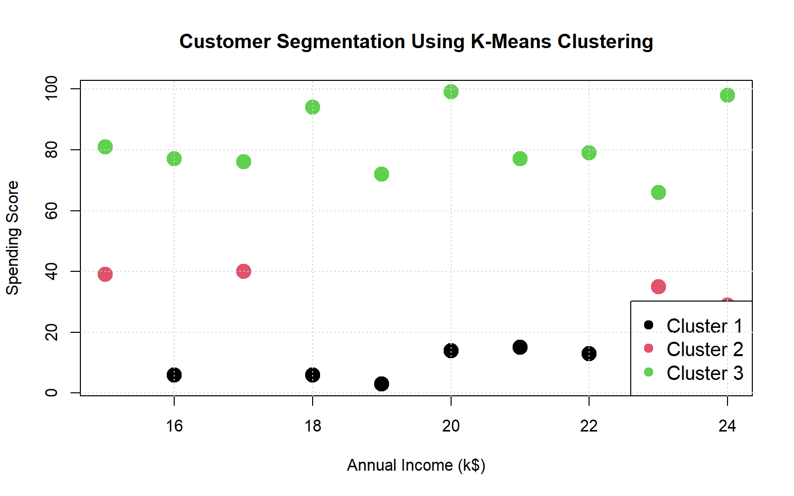
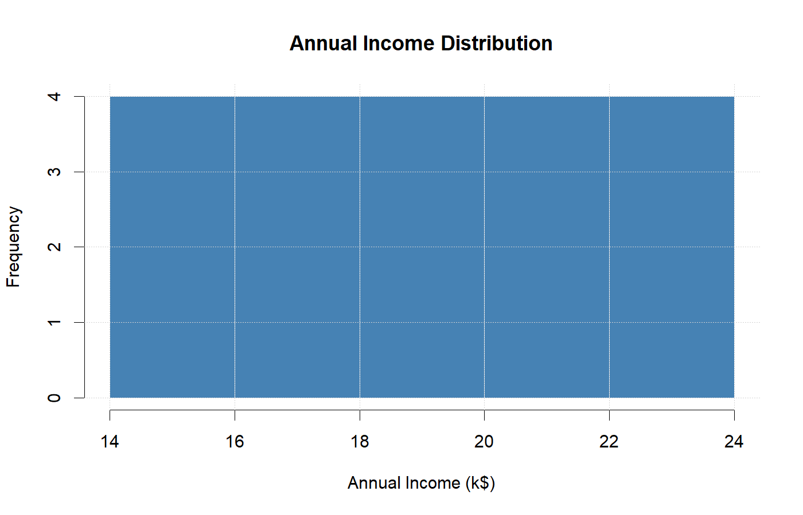
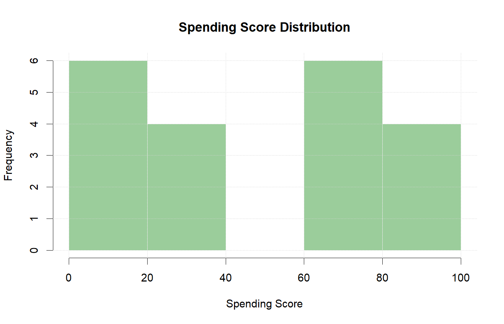
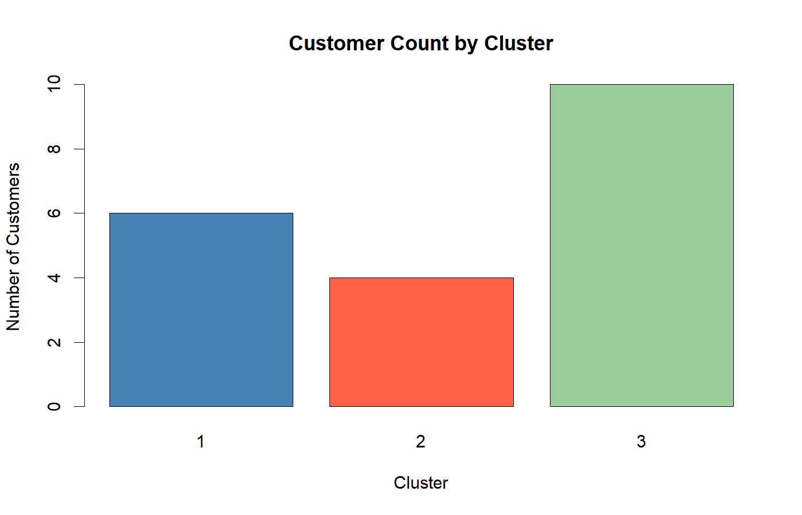

---

title: "Customer Segmentation Analysis"
author: "Layana"
date: "`r Sys.Date()`"
output: html_document
---------------------

# Introduction

Customer segmentation helps businesses understand customer behavior and target marketing strategies effectively.

# Dataset Overview

Variables:

* Age
* Annual Income
* Spending Score

# Summary Statistics

```{r}
customer_data <- read.csv("customer_data.csv")
summary(customer_data)
```

# Customer Clusters

```{r echo=FALSE}

```

# Income Distribution

```{r echo=FALSE}

```

# Spending Score Distribution

```{r echo=FALSE}

```

# Cluster Summary

```{r echo=FALSE}

```

# Conclusion

K-Means clustering successfully grouped customers into distinct segments based on annual income and spending behavior. These segments can support targeted marketing and business decision-making.
