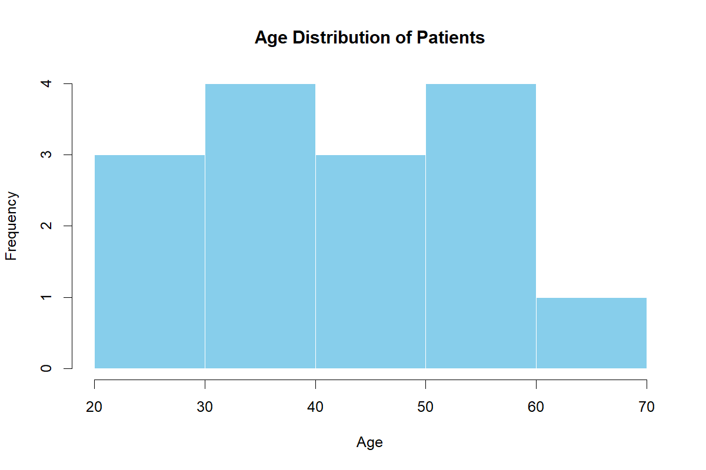
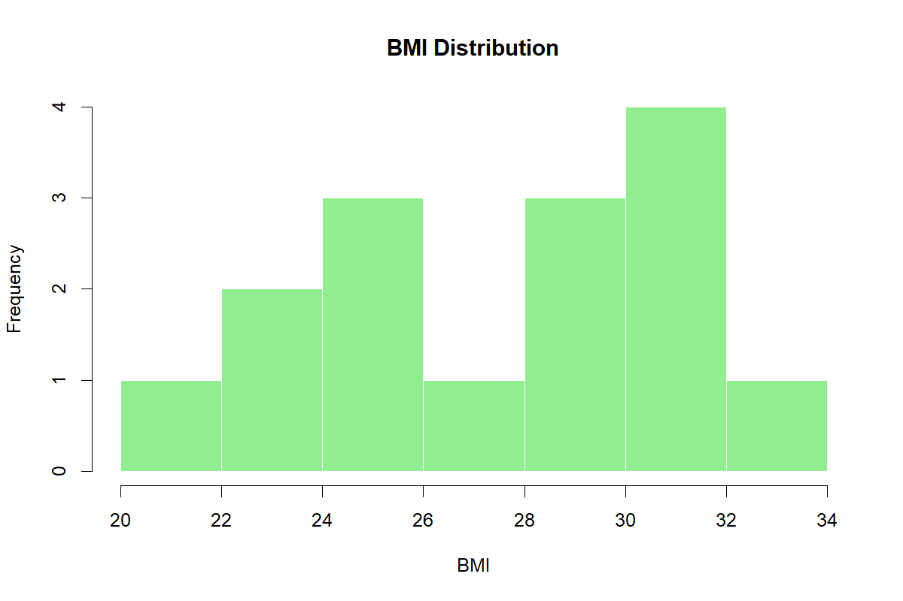
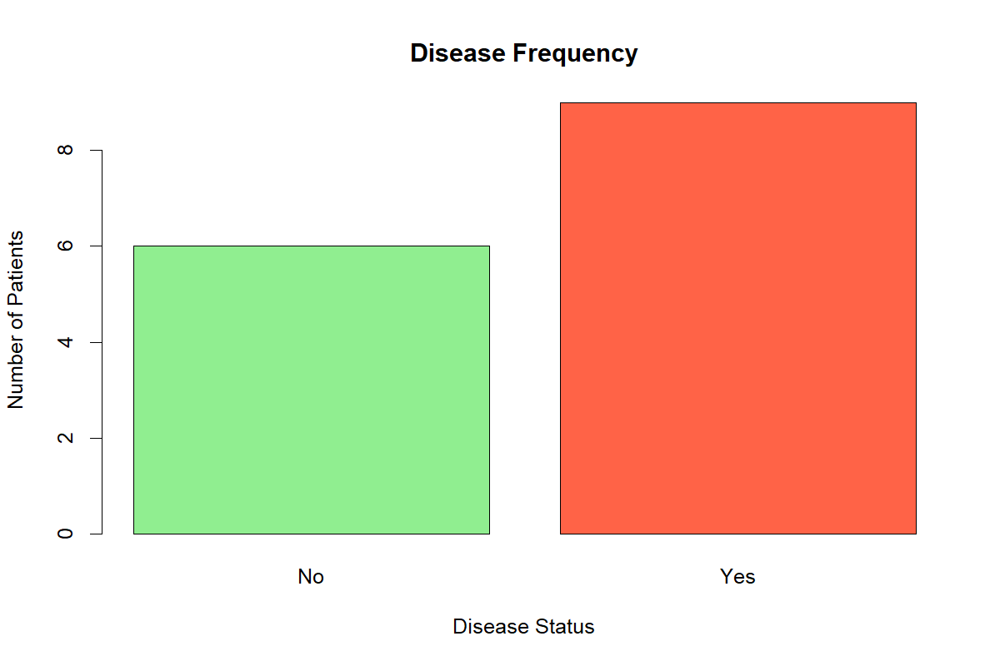

---

title: "Healthcare Data Analysis"
author: "Layana"
date: "`r Sys.Date()`"
output: html_document
---------------------

# Introduction

This project analyzes patient health data using descriptive statistics and visualizations.

# Dataset Overview

Variables:

* Age
* Gender
* BMI
* Blood Pressure
* Disease Status

# Summary Statistics

```{r}
healthcare_data <- read.csv("healthcare_data.csv")
summary(healthcare_data)
```

# Correlation Analysis

```{r}
cor(
  healthcare_data[,c(
    "Age",
    "BMI",
    "Blood_Pressure"
  )]
)
```

# Age Distribution

```{r echo=FALSE}

```

# BMI Distribution

```{r echo=FALSE}

```

# Disease Frequency

```{r echo=FALSE}

```

# Conclusion

The dataset shows relationships between age, BMI, blood pressure, and disease occurrence. These insights can support healthcare analytics and decision-making.
