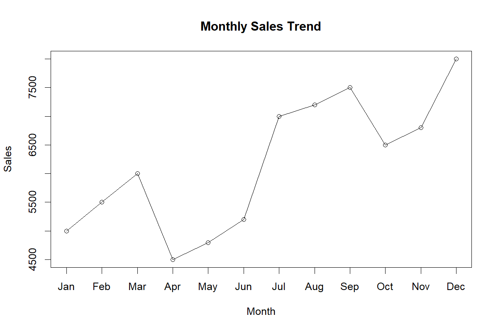
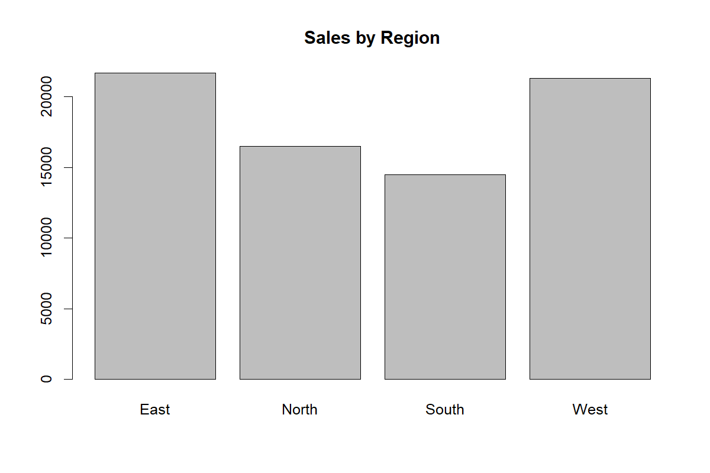
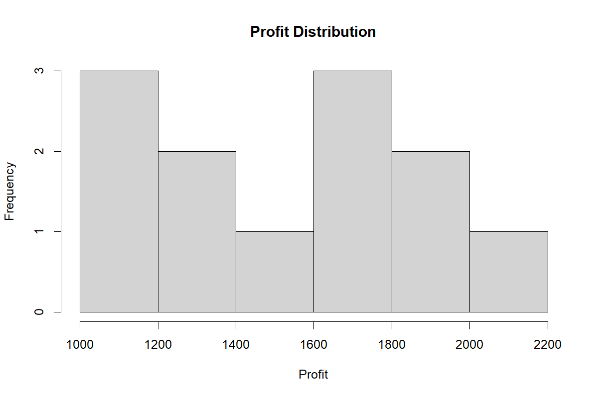

---

title: "Sales Data Analysis"
author: "Layana"
date: "`r Sys.Date()`"
output: html_document
---------------------

# Introduction

This project analyzes sales and profit trends across different regions.

# Dataset Overview

Variables:

* Month
* Region
* Sales
* Profit

# Summary Statistics

```{r}
sales_data <- read.csv("sales_data.csv")
summary(sales_data)
```

# Correlation Analysis

```{r}
cor(sales_data[, c("Sales", "Profit")])
```

# Monthly Sales Trend

```{r echo=FALSE}

```

# Sales by Region

```{r echo=FALSE}

```

# Profit Distribution

```{r echo=FALSE}

```

# Conclusion

The analysis shows a positive relationship between sales and profit. Regional sales performance helps identify key revenue-generating markets.
