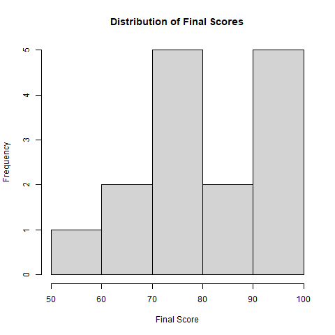

---

title: "Student Performance Analysis"
author: "Layana"
date: "`r Sys.Date()`"
output: html_document
---------------------

# Introduction

This project analyzes student academic performance using statistical methods and visualization techniques.

# Dataset Overview

The dataset contains:

* Study Hours
* Attendance
* Previous Score
* Final Score
* Gender

# Descriptive Statistics

```{r}
student_data <- read.csv("dataset.csv")
summary(student_data)
```

# Correlation Analysis

```{r}
numeric_data <- student_data[,c(
  "Study_Hours",
  "Attendance",
  "Previous_Score",
  "Final_Score"
)]

cor(numeric_data)
```

# Final Score Distribution

```{r echo=FALSE}

```

# Conclusion

Student performance is strongly influenced by study hours, attendance, and previous academic scores.
